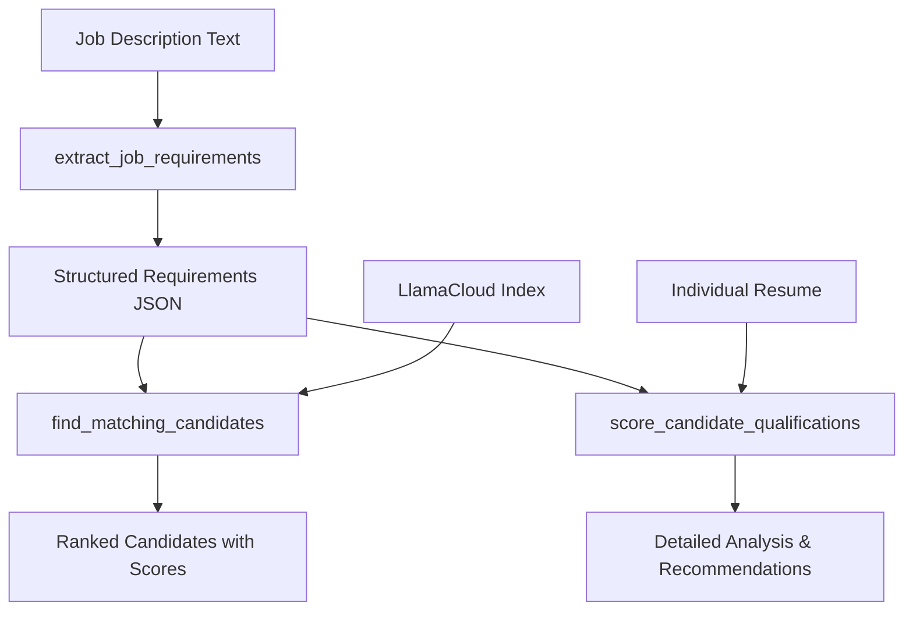

# Job Matching MCP Server

A Model Context Protocol (MCP) server that provides intelligent job matching capabilities. Extract structured job requirements from job descriptions and find/rank candidates from your LlamaCloud resume index.

## 🚀 Features

### Core Job Matching Functions

1. **`extract_job_requirements`** - Extract structured data from job description text
2. **`find_matching_candidates`** - Find and rank candidates from LlamaCloud index  
3. **`search_candidates_by_skills`** - Search candidates by specific skills
4. **`score_candidate_qualifications`** - Score candidate against job requirements

### Additional Functions

- **`add`** / **`subtract`** / **`multiply`** - Basic math functions (backward compatibility)

## 📋 Available MCP Tools


### Job Description Processing
- `extract_job_requirements(job_description_text: str)` - Extract structured job requirements from text

### Candidate Management
- `find_matching_candidates(required_qualifications: str, preferred_qualifications: str, top_k: int, enable_reranking: bool)` - Find candidates matching job qualifications
- `search_candidates_by_skills(skills: str, top_k: int)` - Search candidates by specific skills
- `score_candidate_qualifications(candidate_resume: str, required_qualifications: str, preferred_qualifications: str, job_title: str, job_description: str)` - Score candidate against job requirements

## 📋 Function Details

### 1. Extract Job Requirements
```python
extract_job_requirements(jd_text: str) -> str
```

**Input:** Job description text (copied from job posting)

**Output:** JSON string containing:
- `title`: Job title
- `company`: Company name
- `location`: Job location
- `required_qualifications`: Array of required qualifications
- `preferred_qualifications`: Array of preferred qualifications
- `description`: Job summary
- `experience_level`: Experience level (entry/mid/senior)
- `employment_type`: Employment type (full-time/contract/etc.)

### 2. Find and Rank Candidates from LlamaCloud
```python
find_matching_candidates(required_qualifications: str, preferred_qualifications: str, top_k: int, enable_reranking: bool) -> str
```

**Input:** 
- `required_qualifications`: Comma-separated required qualifications
- `preferred_qualifications`: Comma-separated preferred qualifications  
- `top_k`: Maximum candidates to retrieve (default: 10)
- `enable_reranking`: Whether to enable reranking (default: True)

**Output:** JSON string containing:
- `candidates`: Array of candidates with scores and analysis
- `total_candidates`: Number of candidates found
- `search_parameters`: Details about search configuration

**Key Features:**
- **Retrieves candidates from LlamaCloud index** using semantic search
- **Weighted scoring**: Required qualifications have higher weight
- **Match percentage**: Overall compatibility score
- **Detailed explanations**: For each qualification assessment

### 3. Search Candidates by Skills
```python
search_candidates_by_skills(skills: str, top_k: int) -> str
```

**Input:**
- `skills`: Comma-separated list of skills or keywords
- `top_k`: Number of top candidates to retrieve (default: 10)

**Output:** JSON with matching candidates and their scores

### 4. Score Candidate Qualifications
```python
score_candidate_qualifications(candidate_resume: str, required_qualifications: str, preferred_qualifications: str, job_title: str, job_description: str) -> str
```

**Input:**
- `candidate_resume`: The candidate's resume text
- `required_qualifications`: Comma-separated required qualifications
- `preferred_qualifications`: Comma-separated preferred qualifications
- `job_title`: Job title for context (optional)
- `job_description`: Job description for context (optional)

**Output:** Comprehensive analysis including:
- Strengths and weaknesses
- Detailed scoring breakdown
- Hiring recommendations
- Role fit assessment

## 🛠️ Setup & Configuration

### 1. Configure API Keys & Settings

You have **two options** for configuration:

#### Option A: Environment Variables (Recommended for Production)
```bash
# Required: OpenAI API Key
export OPENAI_API_KEY="your-openai-api-key"

# Required: LlamaCloud Configuration  
export LLAMA_CLOUD_API_KEY="your-llamacloud-api-key"
export LLAMA_CLOUD_INDEX_NAME="your-resume-index-name"
export LLAMA_CLOUD_PROJECT_NAME="your-project-name"
export LLAMA_CLOUD_ORGANIZATION_ID="your-organization-id"

# Optional: Server Configuration
export PORT="8080"
export HOST="0.0.0.0"
export REQUEST_TIMEOUT="30.0"
export OPENAI_TEMPERATURE="0.1"
```

#### Option B: Direct Configuration in config.py (For Local Development)
1. **Open `config.py`** and replace the placeholder values:
   ```python
   # Replace these placeholder values with your actual API keys:
   OPENAI_API_KEY = "your-actual-openai-api-key-here"
   LLAMA_CLOUD_API_KEY = "your-actual-llamacloud-api-key-here"
   LLAMA_CLOUD_ORGANIZATION_ID = "your-actual-org-id-here"
   LLAMA_CLOUD_INDEX_NAME = "your-actual-index-name"
   ```

2. **⚠️ Security Warning**: If you edit `config.py` directly, **never commit your API keys to version control!**

#### Getting Your API Keys:
- **OpenAI API Key**: Get from [OpenAI Platform](https://platform.openai.com/api-keys)
- **LlamaCloud API Key**: Get from [LlamaCloud Console](https://cloud.llamaindex.ai/)
- **LlamaCloud Org ID**: Found in your LlamaCloud project settings
- **LlamaCloud Index Name**: The name of your resume index in LlamaCloud

*Without LlamaCloud credentials, the server uses mock candidate data for testing.*

### 2. Protect Your API Keys (Important!)

If you're planning to commit this code to version control, create a `.gitignore` file to protect your sensitive information:

```bash
# Create .gitignore file
cat > .gitignore << EOF
# Environment variables and sensitive files
.env
.env.local
.env.production
config_local.py

# Python
__pycache__/
*.pyc
*.pyo
*.pyd
.Python
.venv/
venv/

# IDE
.vscode/
.idea/
*.swp
*.swo

# OS
.DS_Store
Thumbs.db
EOF
```

**Alternative**: You can also create a separate `config_local.py` file with your actual keys and import it in `config.py`, then add `config_local.py` to `.gitignore`.

### 3. Install Dependencies

```bash
# Install using uv (recommended)
uv install

# Or using pip
pip install fastmcp httpx
```

### 4. Run the Server

```bash
python server.py
```

Server starts on `http://localhost:8080/mcp` (or `PORT` environment variable)

## 🧪 Testing

Run the comprehensive test suite:

```bash
# Start the server first
python server.py

# In another terminal, run tests
python test_server.py
```

The test suite will:
- ✅ Extract job requirements from sample JD
- ✅ Retrieve and rank candidates from LlamaCloud (or mock data)
- ✅ Perform detailed analysis of top candidate
- ✅ Test backward compatibility functions

## 📊 How It Works

### Architecture Overview

1. **Job Description Processing**
   - Uses OpenAI to extract structured requirements from free-form JD text
   - Separates required vs. preferred qualifications
   - Extracts metadata (title, company, location, etc.)

2. **Candidate Retrieval**
   - Queries LlamaCloud index using semantic search
   - Builds search query from job requirements
   - Retrieves top candidates with similarity scores

3. **Intelligent Scoring**
   - Uses OpenAI to score each candidate (0-2 scale)
   - **0**: Not Met, **1**: Somewhat Met, **2**: Strongly Met
   - Required qualifications weighted 2x in final score
   - Provides explanations for each score

4. **Match Calculation**
   ```
   Weighted Score = (Required Total × 2) + Preferred Total
   Match % = (Weighted Score / Max Possible Score) × 100
   ```

### Data Flow



## 🎯 Use Cases

### 1. Automated Resume Screening
```python
# Extract requirements from job posting
job_reqs = extract_job_requirements(job_posting_text)

# Find top candidates from your resume database
top_candidates = find_matching_candidates("Python, JavaScript, React", "AWS, Docker", 10, True)

# Get detailed analysis of promising candidates
for candidate in top_5:
    analysis = score_candidate_qualifications(candidate['resume'], job_reqs, candidate['name'])
```

### 2. Hiring Pipeline Integration
- **ATS Integration**: Automatically score incoming applications
- **Recruiter Tools**: Provide data-driven candidate rankings
- **Interview Prep**: Generate candidate-specific interview questions

### 3. Job Market Analysis
- **Requirement Trends**: Track common qualifications across postings
- **Candidate Gap Analysis**: Identify missing skills in candidate pool
- **Salary Benchmarking**: Correlate requirements with compensation data

## 🚀 Deployment

### Prerequisites

Make sure you have the following set up:
- Python 3.10+
- UV package manager
- Google Cloud SDK (gcloud)
- Project ID configured: `export PROJECT_ID=<your-project-id>`
- Artifact Registry repository created: `remote-mcp-servers`

### Local Development

```bash
# 1. Install dependencies
uv install

# 2. Configure API keys (choose one method):

# Method A: Set environment variables
export OPENAI_API_KEY="your-openai-api-key"
export LLAMA_CLOUD_API_KEY="your-llamacloud-api-key"
export LLAMA_CLOUD_INDEX_NAME="your-index-name"
export LLAMA_CLOUD_ORGANIZATION_ID="your-org-id"

# Method B: Edit config.py directly (see configuration section above)

# 3. Run server
python server.py
```

The server will start on `http://localhost:8080/mcp` and log which configuration it's using:
```
[INFO]: LlamaCloudService initialized with index: your-index-name
[INFO]: MCP server starting on 0.0.0.0:8080
```

#### Quick Configuration Test:
You can verify your configuration is working by running:
```bash
python -c "from config import OPENAI_API_KEY, LLAMA_CLOUD_API_KEY, LLAMA_CLOUD_INDEX_NAME; print(f'OpenAI: {OPENAI_API_KEY[:10]}..., LlamaCloud: {LLAMA_CLOUD_API_KEY[:10]}..., Index: {LLAMA_CLOUD_INDEX_NAME}')"
```

If you see placeholder values like "your-openai-api-key-here", your configuration needs to be updated.

### Docker Deployment
```bash
# Build image
docker build -t job-matching-mcp .

# Run container
docker run -p 8080:8080 \
  -e OPENAI_API_KEY="your-key" \
  -e LLAMA_CLOUD_API_KEY="your-key" \
  job-matching-mcp
```

### Google Cloud Run Deployment

**📚 Reference Documentation**: [Build and Deploy a Remote MCP Server to Google Cloud Run in Under 10 Minutes](https://cloud.google.com/blog/topics/developers-practitioners/build-and-deploy-a-remote-mcp-server-to-google-cloud-run-in-under-10-minutes)

#### Initial Deployment

```bash
# Build and push to Artifact Registry
gcloud builds submit --region=us-central1 \
  --tag us-central1-docker.pkg.dev/$PROJECT_ID/remote-mcp-servers/mcp-server:latest

# Deploy to Cloud Run
gcloud run deploy mcp-server \
  --image us-central1-docker.pkg.dev/$PROJECT_ID/remote-mcp-servers/mcp-server:latest \
  --region=us-central1 \
  --no-allow-unauthenticated \
  --set-env-vars OPENAI_API_KEY="your-key",LLAMA_CLOUD_API_KEY="your-key"
```

#### Redeployment Steps

After making code changes to your MCP server, follow these steps to redeploy:

**Step 1: Rebuild the container and push to Artifact Registry**

```bash
gcloud builds submit --region=us-central1 \
  --tag us-central1-docker.pkg.dev/$PROJECT_ID/remote-mcp-servers/mcp-server:latest
```

**Step 2: Re-deploy the updated container to Cloud Run**

```bash
gcloud run deploy mcp-server \
  --image us-central1-docker.pkg.dev/$PROJECT_ID/remote-mcp-servers/mcp-server:latest \
  --region=us-central1 \
  --no-allow-unauthenticated
```

**Step 3: Test the deployment (optional)**

Start the Cloud Run proxy to test your updated server:

```bash
gcloud run services proxy mcp-server --region=us-central1
```

Then run your test script:

```bash
uv run test_server.py
```

## 📁 Project Structure

```
mcp-on-cloudrun/
├── config.py                 # Configuration constants
├── models.py                 # Data structures
├── server.py                 # Main MCP server
├── Dockerfile               # Container configuration
├── pyproject.toml           # Python dependencies
├── services/
│   ├── openai_service.py    # OpenAI API integration
│   └── llamacloud_service.py # LlamaCloud integration
├── tools/
│   ├── math_tools.py        # Math operations (add, subtract, multiply)
│   ├── job_tools.py         # Job description extraction
│   └── candidate_tools.py   # Candidate search and scoring
└── test_server.py           # Test client
```

## 🔧 Customization

### Scoring Criteria
Modify the scoring prompts in `services/openai_service.py` to adjust evaluation criteria:
- Change scoring scale (0-2 to 0-5, etc.)
- Adjust weighting between required/preferred qualifications
- Add domain-specific evaluation criteria

### LlamaCloud Integration
For production deployment with real candidate data:
1. Set up LlamaCloud account and create resume index
2. Configure environment variables in `config.py`
3. Replace mock candidate data with actual LlamaCloud API calls

### OpenAI Model Selection
Change the model in `config.py`:
```python
OPENAI_MODEL = "gpt-4o-mini"  # Fast and cost-effective
# OPENAI_MODEL = "gpt-4o"     # Higher quality, more expensive
```

## 📈 Performance & Scaling

- **Concurrent Requests**: FastMCP handles multiple simultaneous job matching requests
- **Caching**: Consider implementing Redis for frequent job requirement extractions
- **Rate Limiting**: OpenAI API has rate limits; implement queuing for high-volume usage
- **Cost Optimization**: Use `gpt-4o-mini` for most operations, `gpt-4o` for critical analysis

## 🔐 Security Considerations

### Security Notes

- **Always use `--no-allow-unauthenticated`** to require authentication for Cloud Run
- Ensure users have the `roles/run.invoker` IAM role to access the server
- Use the Cloud Run proxy for local testing with authentication
- **API Keys**: Never commit API keys to version control
- **Input Validation**: Server validates all inputs and handles malformed data
- **Error Handling**: Graceful degradation when external services are unavailable
- **Data Privacy**: Resume data processed through OpenAI; consider data retention policies

## 🔍 Troubleshooting

### Common Issues:

#### Configuration Issues:
1. **"Invalid API key" errors**: 
   - Check that your API keys are correctly set in `config.py` or environment variables
   - Verify API keys are valid and have proper permissions
   - For OpenAI: Ensure you have credits/billing set up

2. **"LlamaCloud index not found"**:
   - Verify `LLAMA_CLOUD_INDEX_NAME` matches your actual index name
   - Check `LLAMA_CLOUD_ORGANIZATION_ID` is correct
   - Ensure your LlamaCloud API key has access to the specified index

3. **Server shows placeholder values**:
   - If you see "your-openai-api-key-here" in logs, your config isn't loading properly
   - Check that you've either set environment variables OR edited `config.py` directly
   - Restart the server after making configuration changes

#### Deployment Issues:
4. **Authentication errors**: Ensure Cloud Run proxy is running and you have proper IAM roles
5. **Build failures**: Check Dockerfile and dependencies in pyproject.toml
6. **Port conflicts**: Use `lsof -ti:8080 | xargs kill -9` to free up port 8080

### Logs:
View Cloud Run logs:
```bash
gcloud run services logs tail mcp-server --region=us-central1
```

View local server logs:
```bash
# Server logs are printed to console when running locally
python server.py
```

## 🤝 Contributing

1. Fork the repository
2. Create a feature branch
3. Add tests for new functionality
4. Ensure all tests pass
5. Submit a pull request

## 📄 License

MIT License - see LICENSE file for details.

---

**Ready to revolutionize your hiring process with AI-powered job matching!** 🎯✨ 